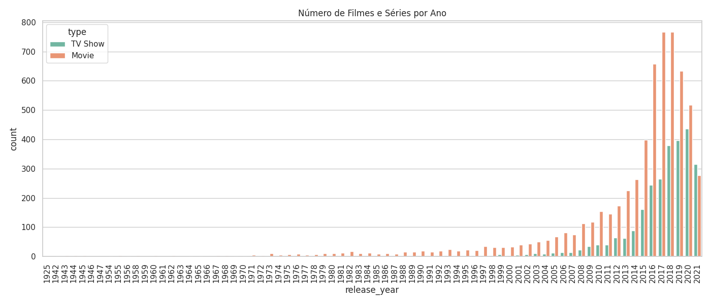
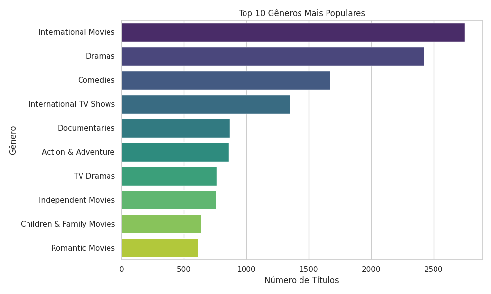
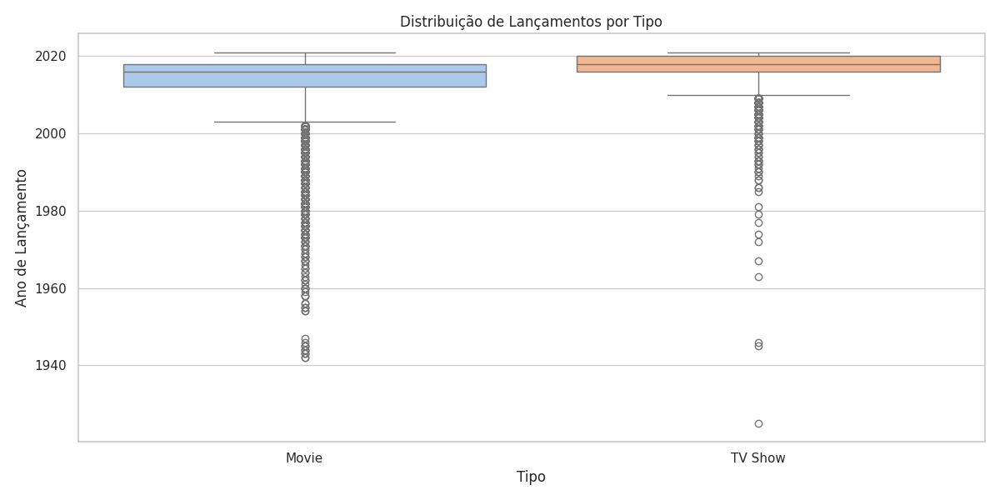
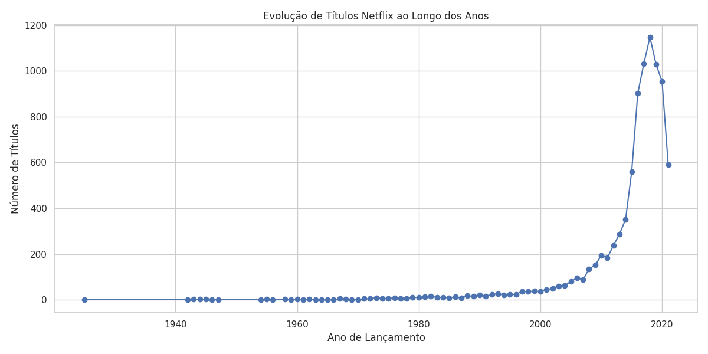
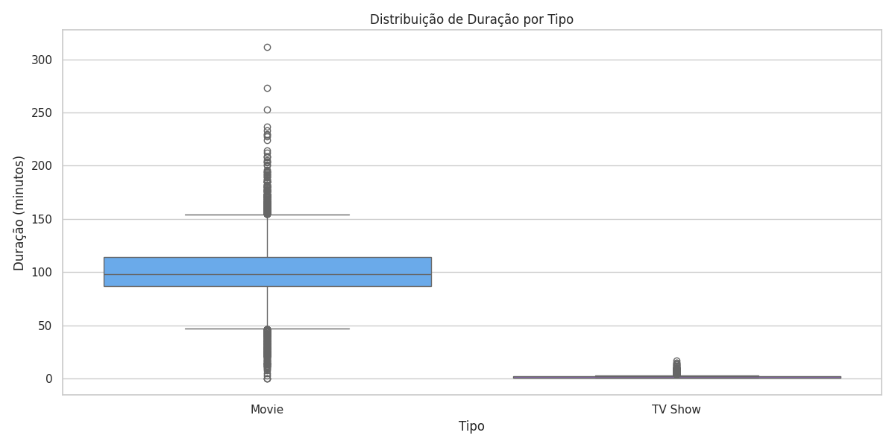

# Netflix Data Analysis - Projeto Atualizado

## Objetivo
Como parte da minha evolução em análise de dados, revisitei meu **primeiro projeto com o dataset da Netflix** e implementei melhorias.  
O objetivo é explorar lançamentos, gêneros, duração, ratings e tendências de filmes e séries ao longo dos anos.

## Ferramentas Utilizadas
- Python
- Pandas
- Matplotlib
- Seaborn

## Principais Insights
1. **Filmes vs Séries:** Crescimento de títulos ao longo dos anos e comparação entre filmes e séries.  
2. **Gêneros mais populares:** Top 10 gêneros com maior número de títulos.  
3. **Distribuição de ratings:** Filmes e séries com avaliações variadas; imóveis com preço médio tendem a avaliações mais consistentes.  
4. **Duração:** Comparação da duração de filmes vs séries.  
5. **Evolução de lançamentos:** Análise da quantidade de títulos lançados por ano.

## Gráficos

